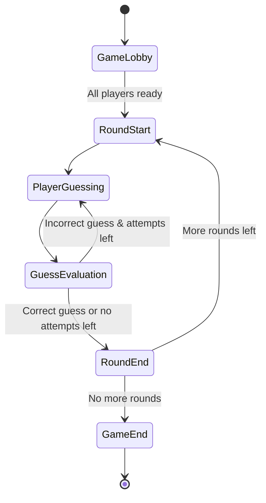
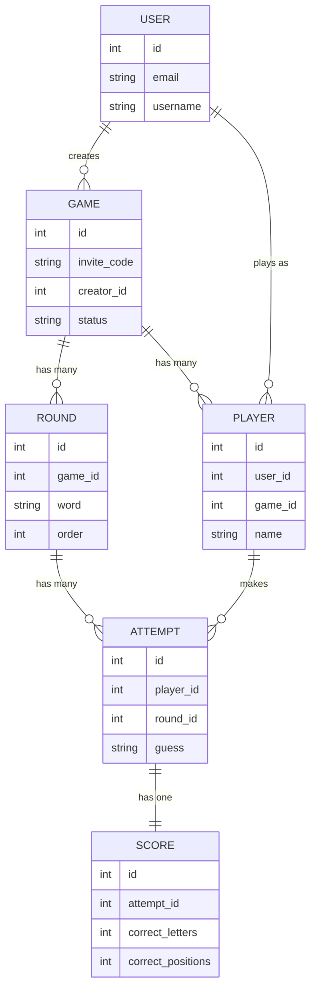

# WordParty.co

Welcome to WordParty.co, a multiplayer word guessing game that brings friends together in a battle of wits and words!

## Table of Contents

- [Overview](#overview)
- [Getting Started](#getting-started)
  - [Prerequisites](#prerequisites)
  - [Installation](#installation)
- [Running the Application](#running-the-application)
- [Running Tests](#running-tests)
- [Gameplay](#gameplay)
- [Database Structure](#database-structure)
- [Contributing](#contributing)
- [License](#license)

## Overview

WordParty.co is a Ruby on Rails application that allows users to create and join multiplayer word guessing games. Players compete to guess a secret word within a limited number of attempts, similar to Wordle, but with a social twist.

## Getting Started

### Prerequisites

Ensure you have the following installed on your local machine:

- Ruby (version 3.3.0 or later)
- SQLite3

### Installation

1. Clone the repository:
   ```
   git clone https://github.com/vormwald/wordparty.git
   cd wordparty
   ```

2. Install the required gems:
   ```
   bin/setup
   ```


## Running the Application

To start the Rails server and Tailwind CSS compiler:

```
bin/dev
```

Visit `http://localhost:3000` in your web browser to access the application.

## Running Tests

We use RSpec for our test suite. To run all tests:

```
bin/rspec
```

To run specific test files:

```
bin/rspec spec/models/game_spec.rb
```

## Gameplay

The gameplay flow of WordParty.co can be visualized as follows:



## Database Structure

The core database structure for WordParty.co is represented in the following Entity-Relationship Diagram:



## Contributing

We welcome contributions to WordParty.co! Please read our [CONTRIBUTING.md](CONTRIBUTING.md) file for details on our code of conduct and the process for submitting pull requests.

## License

This project is licensed under the MIT License - see the [LICENSE.md](LICENSE.md) file for details.