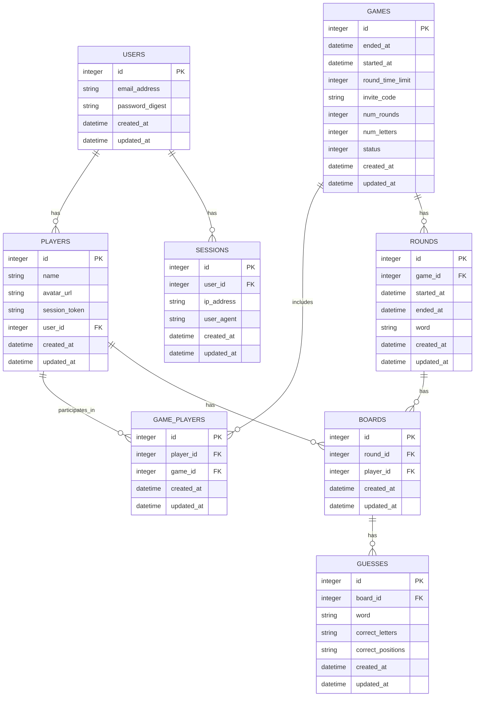

# WordPlay Database Design

## Outline

1. [Introduction](#1-introduction)
2. [User Management](#2-user-management)
   - [Users](#21-users)
   - [Sessions](#22-sessions)
   - [Players](#23-players)
3. [Game Structure](#3-game-structure)
   - [Games](#31-games)
   - [GamePlayers](#32-gameplayers)
   - [Rounds](#33-rounds)
   - [Boards](#34-boards)
   - [Guesses](#35-guesses)
4. [Relationships and Associations](#4-relationships-and-associations)
5. [Key Features and Considerations](#5-key-features-and-considerations)

## 1. Introduction

This document outlines the database design for the WordPlay application, detailing the various models and their roles in the system. The design supports user management, game creation and progression, and player interactions.

## 2. User Management

### 2.1. Users

The `User` model represents registered users of the application.

- **Role**: Stores essential user information and authentication details.
- **Key Fields**: 
  - `id`: Primary key
  - `email_address`: Unique identifier for login
  - `password_digest`: Encrypted password for security

### 2.2. Sessions

The `Session` model manages user login sessions. It was added via Rails 8 authentication generators.

- **Role**: Tracks active user sessions for security and user experience.
- **Key Fields**:
  - `id`: Primary key
  - `user_id`: Foreign key linking to Users
  - `ip_address`: IP address of the session
  - `user_agent`: Browser/device information

### 2.3. Players

The `Player` model represents a user's game persona.

- **Role**: Stores game-specific user information and links users to games.
- **Key Fields**:
  - `id`: Primary key
  - `user_id`: Foreign key linking to Users
  - `name`: Player's display name
  - `avatar_url`: URL to player's avatar image
  - `session_token`: For managing player sessions

## 3. Game Structure

### 3.1. Games

The `Game` model represents individual game instances.

- **Role**: Manages game settings, progression, and overall state.
- **Key Fields**:
  - `id`: Primary key
  - `started_at`, `ended_at`: Timestamps for game duration
  - `round_time_limit`: Time allowed for each round
  - `invite_code`: For joining private games
  - `num_rounds`, `num_letters`: Game configuration
  - `status`: Current state of the game

### 3.2. GamePlayers

The `GamePlayer` model links Players to Games.

- **Role**: Manages the relationship between players and the games they participate in.
- **Key Fields**:
  - `game_id`: Foreign key linking to Games
  - `player_id`: Foreign key linking to Players

### 3.3. Rounds

The `Round` model represents individual rounds within a game.

- **Role**: Tracks the progression of rounds in a game.
- **Key Fields**:
  - `id`: Primary key
  - `game_id`: Foreign key linking to Games

### 3.4. Boards

The `Board` model represents the game board for each player in each round.

- **Role**: Stores the state of each player's board during a round.
- **Key Fields**:
  - `id`: Primary key
  - `round_id`: Foreign key linking to Rounds
  - `player_id`: Foreign key linking to Players

### 3.5. Guesses

The `Guess` model tracks player guesses during the game.

- **Role**: Records and validates player word submissions.
- **Key Fields**:
  - `id`: Primary key
  - `board_id`: Foreign key linking to Boards
  - `word`: The guessed word

## 4. Relationships and Associations

- Users have many Sessions and one Player
- Players participate in many Games through GamePlayers
- Games have many Rounds, which have many Boards
- Players have many Boards across different Games and Rounds
- Boards have many Guesses

## 5. Key Features and Considerations

- The design supports multiple concurrent games with varying configurations.
- Player progression and game history can be tracked across multiple games.
- The separation of Users and Players allows for guest play and potential future features like multiple personas per user.
- Game invite system is supported through the `invite_code` in the Games model.
- The design allows for easy expansion, such as adding scoring systems or additional game modes.

