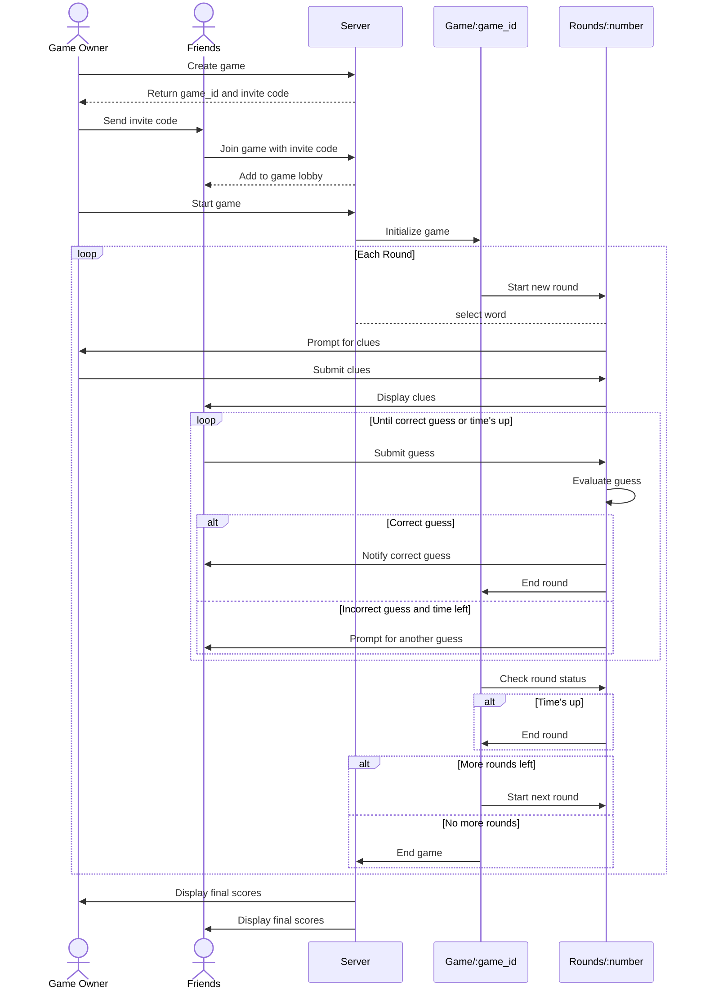

## Gameplay [WIP]

The gameplay flow of WordParty.co can be visualized as follows:

### Gameplay Flow Explanation:

1. **Game Creation**: The Game Owner creates a new game on the server.
2. **Invitation**: The server provides a game_id and invite code, which the Game Owner shares with friends.
3. **Joining**: Friends use the invite code to join the game lobby.
4. **Game Start**: The Game Owner initiates the game, moving to the game/:game_id path.
5. **Rounds**: For each round (at game/:game_id/rounds/:number):
   a. The Game Owner selects a word.
   b. The Game Owner provides clues for the word.
   c. Friends attempt to guess the word.
   d. Guesses are evaluated until a correct guess is made or time runs out.
6. **Game End**: After all rounds, the game ends, and final scores are displayed to all players.

This sequence shows the flow from game creation through multiple rounds of play, emphasizing the role of the Game Owner in starting the game and managing each round. The diagram also illustrates the interaction between players, the game instance, and individual rounds.
